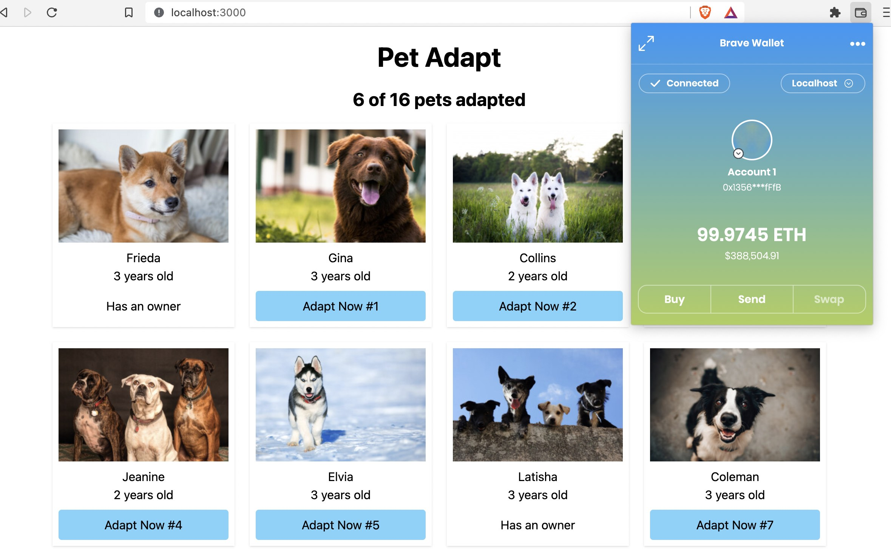

# Truffle Suite with Next.js & Tailwind.css 

## Pet Adapt Demo App

Originally published on [official page of truffle suite]( https://trufflesuite.com/tutorial/) using JQuery and Bootstrap.




## Installation

Install and run local **Ganache** blockchain for development.

> Available at https://trufflesuite.com/ganache/


Install **Truffle** globally.

```bash
npm install -g truffle
```


Install Next.js App package dependencies in the project folder.

```bash
# change working directory to project folder
cd truffle-nextjs-pet-adapt

# install dependencies
npm install
```


# Migrate and Start


Before initializing Next.js dev server, migrate the smart contracts (make sure local blockchain is running).

```bash
truffle compile
truffle migrate
```

`truffle-config.js` is set to deploy built contract artifacts on `public/contracts` folder.
That way next.js can access compiled `Adoption.json` file and initialize `TruffleContact` on the front-end.


Start local development server

```bash
npm run dev
```

Serves the front-end on http://localhost:3000


## Usage

Connect your browser wallet to local blockchain. If your browser doesn't have a crypto wallet, first install one.
The most popular one is  [Metamask](https://metamask.io/). Enable wallet's test networks and switch to local network
so that wallet can access to local blockchain and deployed contracts on it.

Now all is ready click "Adapt Now" button on the local server and adopt a friend. 
You have a centralized front-end connecting to a decentralized backend.


## CLI

As an alternative, Truffle command line interface is available to run methods of deployed contract. Access CLI from console:

```bash
truffle console
```
> Alternatively --network parameter is available to access different networks defined in `truffle-config.js`

```bash
npx truffle console --network development
```


Once CLI is available:

```bash
# Fetch contract
contract = await Adoption.deployed()

# Adopt a pet with id
contract.adopt(1)

# Get all adopters empty(0x0) addresses represent not adopted pets.
contract.getAdopters();

# Exit CLI
.exit
```


Check local server and see the CLI changes on the front-end.


## License

The MIT License (MIT). Feel free to modify, use however you like. [License File](LICENSE.md) for more information.
